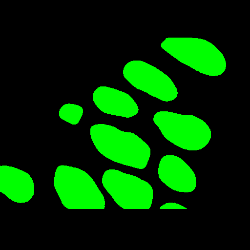

<h2>TensorFlow-FlexUNet-Image-Segmentation-GlaS-MICCAI2015 (2025/06/30)</h2>
This is the first experiment of Image Segmentation for GlaS-MICCAI2015 Colon Histology Images (Benign and Malignant) 
 based on 
our <a href="./src/TensorFlowFlexUNet.py">TensorFlowFlexUNet</a>
 (<b>TensorFlow Flexible UNet Image Segmentation Model for Multiclass</b>) and 512x512 pixels 
  <a href="https://drive.google.com/file/d/1xHkqE-eloibsI3BwPgD_jrtLO1TaRAlt/view?usp=sharing">
Augmented-GlaS-MICCAI2015-ImageMask-Dataset.zip</a>, which was derived by us from the 
<a href="https://www.kaggle.com/datasets/sani84/glasmiccai2015-gland-segmentation">
GlaS@MICCAI'2015: Gland Segmentation
Gland Segmentation in Colon Histology Images Challenge</a>
 
  

<b>Actual Image Segmentation for 512x512 Glas images</b> 
As shown below, the inferred masks look very similar to the ground truth masks.  
<table>
<tr>
<th>Input: image</th>
<th>Mask (ground_truth)</th>
<th>Prediction: inferred_mask</th>
</tr>
<tr>
<td></td>
<td></td>
<td></td>
</tr>
<tr>
<td></td>
<td></td>
<td></td>
</tr>
<tr>
<td></td>
<td></td>
<td></td>
</tr>
</table>

 
<h3>1 Dataset Citation</h3>

The original dataset used here has been taken from the kaggle website: 
<a href="https://www.kaggle.com/datasets/sani84/glasmiccai2015-gland-segmentation">
GlaS@MICCAI'2015: Gland Segmentation
Gland Segmentation in Colon Histology Images Challenge</a>
 
 
<b>About Dataset</b> 
<b>Introduction</b> 
Glands are important histological structures which are present in most organ systems as the main mechanism for secreting proteins and carbohydrates.
It has been shown that malignant tumours arising from glandular epithelium, also known as adenocarcinomas, are the most prevalent form of cancer. 
The morphology of glands has been used routinely by pathologists to assess the degree of malignancy of several adenocarcinomas, including prostate,
breast, lung, and colon.
 
Accurate segmentation of glands is often a crucial step to obtain reliable morphological statistics. Nonetheless, the task by nature is very 
challenging due to the great variation of glandular morphology in different histologic grades. Up until now, the majority of studies 
focus on gland segmentation in healthy or benign samples, but rarely on intermediate or high grade cancer, and quite often, 
they are optimised to specific datasets.
 
In this challenge, participants are encouraged to run their gland segmentation algorithms on images of Hematoxylin and Eosin (H&E) 
stained slides, consisting of a variety of histologic grades. The dataset is provided together with ground truth annotations by 
expert pathologists. The participants are asked to develop and optimise their algorithms on the provided training dataset, and validate 
their algorithm on the test dataset.
 
<b>Data Usage</b> 
The dataset used in this competition is provided for research purposes only. Commercial uses are not allowed.
If you intend to publish research work that uses this dataset, you must cite our review paper to be published after the competition

K. Sirinukunwattana, J. P. W. Pluim, H. Chen, X Qi, P. Heng, Y. Guo, L. Wang, B. J. Matuszewski, E. Bruni, U. Sanchez, A. Böhm, O. Ronneberger, B. Ben Cheikh, D. Racoceanu, P. Kainz, M. Pfeiffer, M. Urschler, D. R. J. Snead, N. M. Rajpoot, "Gland Segmentation in Colon Histology Images: The GlaS Challenge Contest" http://arxiv.org/abs/1603.00275 [Preprint]

The details of the journal version will be available soon.

AND the following paper, wherein the same dataset was first used: 
K. Sirinukunwattana, D.R.J. Snead, N.M. Rajpoot, "A Stochastic Polygons Model for Glandular Structures in Colon Histology Images," in IEEE Transactions on Medical Imaging, 2015
doi: 10.1109/TMI.2015.2433900
 
 
<h3>
<a id="2">
2 GlaS ImageMask Dataset
</a>
</h3>
 If you would like to train this GlaS-MICCAI2015 Colon Histology Images Segmentation model by yourself,
 please download our dataset from the google drive  
<a href="https://drive.google.com/file/d/1xHkqE-eloibsI3BwPgD_jrtLO1TaRAlt/view?usp=sharing">
Augmented-GlaS-MICCAI2015-ImageMask-Dataset.zip</a>.
 
, expand the downloaded ImageMaskDataset and put it under <b>./dataset</b> folder to be
<pre>
./dataset
└─GlaS
    ├─test
    │   ├─images
    │   └─masks
    ├─train
    │   ├─images
    │   └─masks
    └─valid
        ├─images
        └─masks
</pre>
On the derivation of this dataset, please refer to the following Python scripts: 
<li><a href="./generator/ImageMaskDatasetGenerator.py">ImageMaskDatasetGenerator.py</a></li>
<li><a href="./generator/split_master.py">split_master.py</a></li>

 
<b>GlaS Statistics</b> 
 
 
As shown above, the number of images of train and valid datasets is large enough to use for a training set of our segmentation model.
 
 
<b>Train_images_sample</b> 

 
<b>Train_masks_sample</b> 

 

<h3>
3 Train TensorFlowFlexUNet Model
</h3>
 We trained GlaS TensorFlowFlexUNet Model by using the following
<a href="./projects/TensorFlowFlexUNet/GlaS/train_eval_infer.config"> <b>train_eval_infer.config</b></a> file.  
Please move to ./projects/TensorFlowFlexUNet/Glas and run the following bat file. 
<pre>
>1.train.bat
</pre>
, which simply runs the following command. 
<pre>
>python ../../../src/TensorFlowFlexUNetTrainer.py ./train_eval_infer.config
</pre>

<b>Model parameters</b> 
Defined a small <b>base_filters = 16 </b> and large <b>base_kernels = (9,9)</b> for the first Conv Layer of Encoder Block of 
<a href="./src/TensorFlowFlexUNet.py">TensorFlowFlexUNet.py</a> 
and a large num_layers (including a bridge between Encoder and Decoder Blocks).
<pre>
[model]
;You may specify your own UNet class derived from our TensorFlowFlexModel
model         = "TensorFlowFlexUNet"
generator     =  False
image_width    = 512
image_height   = 512
image_channels = 3
num_classes    = 3

base_filters   = 16
base_kernels   = (9,9)
num_layers     = 8
dropout_rate   = 0.04
dilation       = (3,3)
</pre>
<b>Learning rate</b> 
Defined a small learning rate.  
<pre>
[model]
learning_rate  = 0.00007
</pre>
<b>Loss and metrics functions</b> 
Specified "categorical_crossentropy" and <a href="./src/dice_coef_multiclass.py">"dice_coef_multiclass"</a>. 
<pre>
[model]
loss           = "categorical_crossentropy"
metrics        = ["dice_coef_multiclass"]
</pre>
<b>Dataset class</b> 
Specifed <a href="./src/ImageCategorizedMaskDataset.py">ImageCategorizedMaskDataset</a> class. 
<pre>
[dataset]
class_name    = "ImageCategorizedMaskDataset"
</pre>
 
<b>Learning rate reducer callback</b> 
Enabled learing_rate_reducer callback, and a small reducer_patience.
<pre> 
[train]
learning_rate_reducer = True
reducer_factor     = 0.5
reducer_patience   = 4
</pre>
<b>Early stopping callback</b> 
Enabled early stopping callback with patience parameter.
<pre>
[train]
patience      = 10
</pre>

<b>RGB Color map</b> 
rgb color map dict for Glas 3 classes. 
<pre>
[mask]
mask_file_format = ".png"
; rgb color map dict for 1+2 classes
; GlaS   black     bengin:green, malignant:red
rgb_map = {(0,0,0):0, (0,255,0):1, (255,0,0):2,}
</pre>

<b>Epoch change inference callback</b> 
Enabled <a href="./src/EpochChangeInferencer.py">epoch_change_infer callback</a></b>. 
<pre>
[train]
epoch_change_infer       = True
epoch_change_infer_dir   =  "./epoch_change_infer"
num_infer_images         = 6
</pre>

By using this callback, on every epoch_change, the inference procedure can be called
 for 6 images in <b>mini_test</b> folder. This will help you confirm how the predicted mask changes 
 at each epoch during your training process.    
As shown below, in UNet training, it's common to see unexpected, really discouraging, prediction results during the initial few epochs. 
Patience is key in these early stages of training. 
As training progresses, the predictions will gradually converge towards the Ground Truth.  
<b>Epoch_change_inference output at starting (epoch 1,2,3)</b> 
 
 
 
<b>Epoch_change_inference output at middlepoint (epoch 48,49,50)</b> 
 
 

<b>Epoch_change_inference output at ending (epoch 98,99,100)</b> 
 
 

In this experiment, the training process was terminated at epoch 100.  
 
 

<a href="./projects/TensorFlowFlexUNet/GlaS/eval/train_metrics.csv">train_metrics.csv</a> 
 

 
<a href="./projects/TensorFlowFlexUNet/GlaS/eval/train_losses.csv">train_losses.csv</a> 
 

 

<h3>
4 Evaluation
</h3>
Please move to <b>./projects/TensorFlowFlexUNet/GlaS</b> folder, 
and run the following bat file to evaluate TensorFlowUNet model for GlaS.
<pre>
./2.evaluate.bat
</pre>
This bat file simply runs the following command.
<pre>
python ../../../src/TensorFlowFlexUNetEvaluator.py ./train_eval_infer_aug.config
</pre>

Evaluation console output: 

  Image-Segmentation-BUSBRA

<a href="./projects/TensorFlowFlexUNet/GlaS/evaluation.csv">evaluation.csv</a> 
The loss (categorical_crossentropy) to this GlaS/test was very low and dice_coef_multiclass 
very high as shown below.
 
<pre>
categorical_crossentropy,0.0264
dice_coef_multiclass,0.9869
</pre>
 

<h3>
5 Inference
</h3>
Please move to a <b>./projects/TensorFlowFlexUNet/GlaS</b> folder 
,and run the following bat file to infer segmentation regions for images by the Trained-TensorFlowUNet model for BUSBRA. 
<pre>
./3.infer.bat
</pre>
This simply runs the following command.
<pre>
python ../../../src/TensorFlowFlexUNetInferencer.py ./train_eval_infer_aug.config
</pre>

<b>mini_test_images</b> 
 
<b>mini_test_mask(ground_truth)</b> 
 

<b>Inferred test masks</b> 
 
 

<b>Enlarged images and masks of 512x512 pixels</b> 

<table>
<tr>
<th>Image</th>
<th>Mask (ground_truth)</th>
<th>Inferred-mask</th>
</tr>
<tr>
<td></td>
<td></td>
<td></td>
</tr>
<tr>
<td></td>
<td></td>
<td></td>
</tr>

<tr>
<td></td>
<td></td>
<td></td>
</tr>

<tr>
<td></td>
<td></td>
<td></td>
</tr>

<tr>
<td></td>
<td></td>
<td></td>
</tr>

<tr>
<td></td>
<td></td>
<td></td>
</tr>

</table>

 

<h3>
References
</h3>
<b>1. Gland Segmentation in Colon Histology Images: The GlaS Challenge Contest</b> 

Korsuk Sirinukunwattana, Josien P. W. Pluim, Hao Chen, Xiaojuan Qi, Pheng-Ann Heng, Yun Bo Guo,  
Li Yang Wang, Bogdan J. Matuszewski, Elia Bruni, Urko Sanchez, Anton Böhm, Olaf Ronneberger,  
Bassem Ben Cheikh, Daniel Racoceanu, Philipp Kainz, Michael Pfeiffer, Martin Urschler,  
David R. J. Snead, Nasir M. Rajpoot  
<a href="https://doi.org/10.48550/arXiv.1603.00275<">
https://doi.org/10.48550/arXiv.1603.00275
</a>
 
<a href="https://ar5iv.labs.arxiv.org/html/1603.00275">https://ar5iv.labs.arxiv.org/html/1603.00275</a>
 
 
<b>2.Tensorflow-Image-Segmentation-Augmented-GlaS-MICCAI2015</b> 
Toshiyuki Arai @antillia.com 
<a href="https://github.com/sarah-antillia/Tensorflow-Image-Segmentation-Augmented-GlaS-MICCAI2015">
https://github.com/sarah-antillia/Tensorflow-Image-Segmentation-Augmented-GlaS-MICCAI2015
</a>

